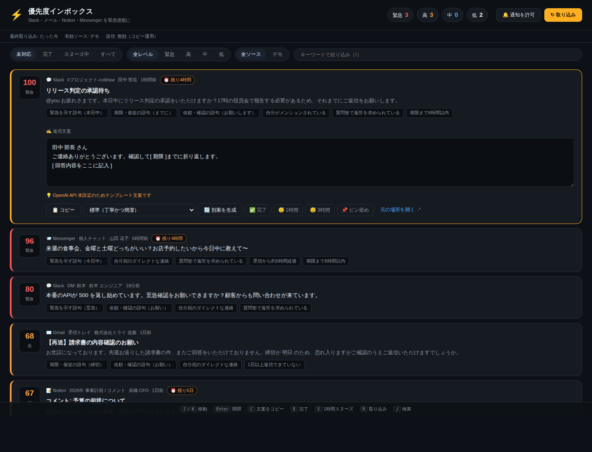

# ⚡ 優先度インボックス

Slack・Gmail・Notion・Facebook Messenger に散らばった「返信しないといけない連絡」を
1 か所に集め、**緊急度が高い順に並べ替え、そのまま送れる返信文案まで用意しておく**専用アプリです。



- 📥 複数サービスの連絡を横断で取り込み（未設定のサービスは自動的にスキップ）
- 🔢 0〜100 のスコアで緊急度を判定し、常に**優先度順**に並べ替え
- ✍️ すべての通知に**返信文案**を自動生成（トーンを変えて何度でも作り直し可）
- 🔔 緊急（スコア 78 以上）の連絡はデスクトップ通知でお知らせ
- ✅ 完了 / 😴 スヌーズ / 📌 ピン留めで、対応済みのものを視界から外す
- ⌨️ キーボードだけで一巡できる（`J`/`K` 移動、`C` コピー、`E` 完了、`S` スヌーズ）

## クイックスタート

```bash
npm install
npm start
# → http://localhost:3000 を開く
```

API キーを何も設定していない状態でも、**デモデータ**で一通りの動作を確認できます。

本番で使う場合は `.env.example` を `.env` にコピーし、使いたいサービスの分だけ埋めてください。

```bash
cp .env.example .env
```

`OPENAI_API_KEY` を設定すると、LLM による緊急度判定（業務インパクトを踏まえた並べ替え）と
文脈に沿った返信文案の生成が有効になります。未設定でもルールベースの判定と
テンプレート文案で動作します。

### 専用アプリとして使う

PWA として配信しているため、Chrome / Edge のアドレスバーの「インストール」から
独立したウィンドウのデスクトップアプリとして起動できます。
常駐させたい場合は `npm start` を pm2 や systemd、`launchd` などに登録してください。

## 対応サービスと必要な設定

| サービス | 取り込む対象 | 必要な環境変数 |
| --- | --- | --- |
| Slack | DM・グループ DM・指定チャンネルの直近メッセージ | `SLACK_TOKEN`（+ `SLACK_CHANNELS`, `SLACK_USER_ID`） |
| Gmail | 検索クエリに一致するメール（既定は未読） | `GMAIL_ACCESS_TOKEN` もしくは `GOOGLE_CLIENT_ID` / `GOOGLE_CLIENT_SECRET` / `GOOGLE_REFRESH_TOKEN` |
| Notion | 最近更新されたページのコメント | `NOTION_TOKEN` |
| Messenger | Facebook ページ受信箱の会話 | `MESSENGER_PAGE_TOKEN` |
| デモ | `data/sample-inbox.json` のサンプル | 他が未設定なら自動で有効 |

いずれか 1 つが失敗しても他のソースの取り込みは続行し、
失敗したソースは画面上部にエラーとして表示されます。

## 優先度の決まり方

1. **ルール判定**（`src/priority.js`）— API キー不要で常に実行される土台のスコア
   - 緊急語（至急・本日中・障害 …）、期限・催促語、依頼語、質問形
   - 自分宛の DM か、自分がメンションされているか、VIP からの連絡か
   - 本文から推定した締切までの残り時間（`本日中` / `明日まで` / `12/5 まで` など）
   - 放置時間、最後の発言が自分かどうか、大人数チャンネルか、自動配信メールか
2. **LLM 判定**（`src/triage.js`）— `OPENAI_API_KEY` がある場合のみ
   - 「相手が待っているか」「放置した場合の損失」を踏まえて 0〜100 で再評価
   - 最終スコア = ルール判定 × 0.4 + LLM 判定 × 0.6
   - 同じスコアなら締切が近い順 → 受信が新しい順

| レベル | スコア |
| --- | --- |
| 緊急 | 78 以上 |
| 高 | 58 以上 |
| 中 | 35 以上 |
| 低 | 35 未満 |

> ルール判定だけの場合はキーワード頼みになるため、「今日中に店を予約したい」といった
> 私用の連絡が障害対応より上に来ることがあります。業務インパクトを踏まえた並べ替えには
> `OPENAI_API_KEY` の設定を推奨します。

## 返信の送信について

既定では**送信機能は無効**で、文案をコピーして各アプリに貼る運用です。
`ALLOW_SEND=true` を設定すると Slack / Gmail / Notion / Messenger への直接送信ボタンが表示されます
（送信前に確認ダイアログが出ます。デモデータには送信できません）。

## API

| メソッド | パス | 説明 |
| --- | --- | --- |
| GET | `/` | 専用アプリ（フロントエンド） |
| GET | `/health` | 従来のヘルスチェック |
| GET | `/api/health` | 稼働状況・ソースの設定状況・件数サマリ |
| GET | `/api/items` | 優先度順の一覧（`status` / `source` / `level` / `q` で絞り込み） |
| GET | `/api/items/:id` | 1 件取得 |
| POST | `/api/refresh` | 取り込みと再判定（`{"force":true}` で全件を再判定） |
| POST | `/api/items/:id/draft` | 文案の再生成（`{"tone":"polite"}`） |
| PUT | `/api/items/:id/draft` | 編集した文案の保存 |
| POST | `/api/items/:id/status` | `open` / `done` / `snoozed`（`snoozeMinutes`） |
| POST | `/api/items/:id/pin` | ピン留めの切り替え |
| POST | `/api/items/:id/send` | 返信の送信（`ALLOW_SEND=true` のときのみ） |
| POST | `/ask` | 従来の汎用プロンプト（後方互換） |

## 構成

```
server.js              起動エントリ（設定表示 → 状態読込 → 起動 → 定期取り込み）
src/config.js          環境変数の読み取り
src/sources/           各サービスのコネクタ（slack / gmail / notion / messenger / demo）
src/priority.js        ルールベースのスコアリングと並べ替え
src/triage.js          LLM による再評価と返信文案の生成
src/pipeline.js        取り込み → 判定 → 保存 の一連の流れ
src/store.js           通知と操作履歴の保持（data/state.json に永続化）
src/api.js, src/app.js HTTP API と Express アプリ
public/                専用アプリのフロントエンド（依存なしの素の JS）
```

取り込んだ内容と操作履歴は `data/state.json`（gitignore 済み）に保存されます。
本文がそのまま含まれるため、共有マシンで使う場合は取り扱いに注意してください。

## テスト

```bash
npm test
```

`node:test` によるスコアリングのユニットテストと、デモソースを使った API の結合テストが動きます。
